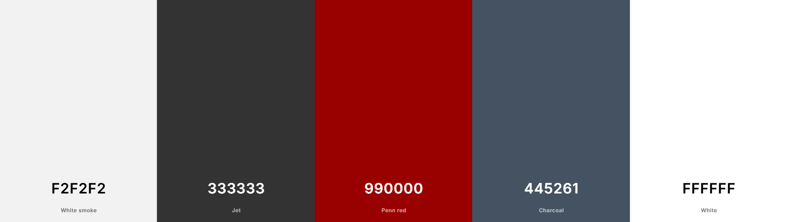

# The Restaurant Reservation System

This is a full-stack framework project built using Django, Python, HTML and CSS. The goal is to allow the user a good 
interface where they can easily manage and make bookings. This website is made it persuite of learning django.

[Visit my website](https://restaurant-booking-systems-c7e901b3d3c6.herokuapp.com/)

SUPERUSER CREDENTIALS:
username - testering
password - testering

For a realife website the password would obviously be different but it dosent contain any real life data, the
credentials are needed to access some of the websites features.

## Table of Contents

- Project Overview
- User Experience (UX)
- Project Features
- Project Structure
- Color Palette
- Technologies Used
- Deployment
- Credits
- Additional Information

## UX

#### Strategy
- Guided by core UX principles, the strategy for the Restaurant Reservation System was developed with a keen
 focus on the target audience and the features that would be most beneficial to them.

#### Target Audience

- The target audience for the Restaurant Reservation System includes:

- Young professionals and adults looking to easily book a table for a dining experience.

- Families who want to reserve a spot for special occasions and weekend outings.

- Anyone interested in a seamless, online restaurant reservation process.

### User Stories

**General Users:**
- As a user, I want to create an account to manage my reservations.
- As a user, I want to log in to my account to access and manage my reservations.
- As a user, I want to make a new reservation to book a table at the restaurant.
- As a user, I want to view my reservations to see my upcoming and past bookings.
- As a user, I want to edit my existing reservations if my plans change.
- As a user, I want to delete reservations that I no longer need.
- As a user, I want an easy-to-navigate website to find information quickly.

**Admin Users:**
- As an admin, I want to view all reservations to manage the restaurant’s bookings.
- As an admin, I want to edit any reservation to correct or update booking details.
- As an admin, I want to delete reservations to manage the restaurant’s schedule.
- As an admin, I want to log in to an admin panel to access reservation management features.

### Navigation
- As a user, I want to easly navigate to Reservations, and log out

### Login/Register
- As a user,I want to log into my account using my username and password.
- As a user, I want to create an account by providing a username, email, and password.
- As a user, I want to securely delete my account and lose my bookings.

*Project kanban board*

## Site Features
 
### Navigation Bar
- A responsive navigation bar with links to Home, Reservations, Login, and Signup pages.

### Footer
- **Social Media Links**: Icons linking to social media profiles.

### Home Page
- **Welcome Section**: An introduction to the restaurant.
- **Responsive Design**: Ensures the homepage looks great on all devices.

### Reservation Features

#### Make a Reservation
Users can make reservations by selecting a date, time, and party size. Unregistered users will be redirected to log in or register. Admins can manage reservations and table availability. The system prevents double-booking and ensures table capacity is not exceeded.

#### Signup Form
- **Input Fields**: Username, email, and password.
- **Submit Button**: To create the account.

#### Login Form
- **Input Fields**: Username and password.
- **Submit Button**: For user login.

#### Logout Button
- Allows users to securely log out of their account.

### Existing Features

- User authentication (sign up, log in, log out)
- Make new reservations
- View list of reservations
- Edit existing reservations
- Delete reservations
- Responsive design with Bootstrap
- CSRF protection

### Future Features

- Email notifications for reservation confirmations and reminders
- Integration with a payment gateway for reservation deposits
- Advanced search and filtering options for reservations
- Mobile app version for easier access
- Implementing a proper 404 page.
- Proper functionality to not load allready booked tables.

### Wireframes

Wireframes were created along with the entity relationship diagrams. The structure remains pretty similar with some parts moving around.

Please note, there is no wireframe for log out since its basically the same as log in and i did not consider it when making the wireframes.

All wireframes were created using [Balsamiq](https://balsamiq.com/).

---

#### Welcome page

---

#### Make Reservation wireframe

---

#### The sign up page

---

#### The log in page

## Database Schema

To gain a comprehensive understanding of my project's structure, I created an ER diagram to illustrate the relationships
between my models. Additionally, 
I mapped out the corresponding views and URLs to visualize the complete flow of user interactions

The entity relationship diagrams were created using [Lucidchart](https://www.lucidchart.com/).

## Structure

The Restaurant Reservation System is structured into several key Django apps,
each responsible for a distinct area of functionality. 
This modular approach ensures that the codebase remains organized and easy to manage. Below are the main apps and their purposes:

- **accounts**: Handles user authentication, including sign-up, log-in, and log-out functionalities.
- **reservations**: Manages all aspects of reservations, including making, viewing, editing, and deleting reservations.
- **tables**: Manages the data related to the tables available at the restaurant, including the number of seats per table.

By keeping these functionalities separate, we ensure that each part of the application is focused on a single responsibility,
 making the code easier to read, maintain, and expand in the future.

## **Models**

## **Models**

### **Tables model**

Tables model:

---

### **Reservations model**

Reservations model i had to remove the comments for the image since the model is so big

### **Time_periods**

Time_periods:

## Colour Palette

* The color palette for this project was used for the calming and basic effect that will help the user to make good and confident bookings.

---

# **Technologies Used**

## **Languages**
- [HTML5](https://en.wikipedia.org/wiki/HTML5)
- [CSS3](https://en.wikipedia.org/wiki/CSS)
- [JavaScript](https://www.javascript.com/)
- [Python](https://www.python.org/)

## **Frameworks, Libraries and Programs**

- [GitHub](https://github.com/) - GitHub is a web-based platform for version control using Git, enabling collaborative software development and hosting of code repositories. GitHub connects to GitPod and Heroku.

- [GitPod](https://gitpod.io/workspaces) - Connected to GitHub, GitPod hosted the coding space, allowing the project to be built and then committed to the GitHub repository.

- [Heroku](https://www.heroku.com/) - Connected to the GitHub repository, Heroku is a cloud application platform used to deploy this project so the backend language can be utilized/tested.

- [Django](https://www.djangoproject.com/) - Django is a high-level web framework for building web applications rapidly with a clean and pragmatic design.

- [ElephantSQL](https://api.elephantsql.com) - ElephantSQL is a hosted PostgreSQL database service that can be seamlessly integrated with Django applications, providing scalable and reliable database solutions.

- [Gunicorn](https://gunicorn.org/) - Gunicorn is a pure-Python HTTP server for WSGI applications.

- [Dj Database URL](https://pypi.org/project/dj-database-url/) - This allows you to utilize the 12factor inspired DATABASE_URL environment variable to configure your Django application.

- [Bootstrap](https://getbootstrap.com/) - Bootstrap is a front-end framework for developing responsive and mobile-first websites quickly and efficiently.

- [Cloudinary](https://cloudinary.com) - Cloudinary is a cloud-based media management platform that offers solutions for storing, optimizing, and delivering images and videos for web and mobile applications.

- [Summernote](https://summernote.org/) - Summernote is a Django app that enables users to easily integrate a rich text editor into their web applications, enhancing event creation and description functionality.

- [Django-allauth](https://www.intenct.nl/projects/django-allall/) - A comprehensive authentication app for Django, supporting social authentication, registration, and account management.

- [Django-crispy-forms](https://django-crispy-forms.readthedocs.io/en/latest/) - Django Crispy Forms is a Django app that provides a better way to generate forms in your Django application.

- [Whitenoise](http://whitenoise.evans.io/en/stable/) - WhiteNoise allows your web app to serve its own static files, making it simpler to deploy on services like Heroku.

- [Font Awesome](https://fontawesome.com/) - Font Awesome is a library of scalable vector icons that can be easily customized and used to enhance the visual appeal of websites and applications.

- [Balsamiq](https://balsamiq.com/) - Balsamiq is a wireframing tool used for creating low-fidelity mockups of user interfaces, allowing for quick and easy visualization of design ideas.

- [Lucidchart](https://lucid.app) - Lucidchart is a web-based diagramming tool that allows users to create and collaborate on flowcharts, ERDs, and other visual representations of data and processes.

- [Am I Responsive](http://ami.responsivedesign.is/) - Am I Responsive is a web tool that allows users to quickly preview how their website appears on various devices and screen sizes, helping to ensure responsiveness and compatibility across platforms.

- [W3C CSS Validator](https://jigsaw.w3.org/css-validator/) - The W3C CSS Validator is a tool used to check the validity and syntax of CSS code, ensuring compliance with web standards set by the World Wide Web Consortium (W3C).

- [W3C Markup Validator](https://validator.w3.org/#validate_by_input) - The W3C Markup Validator is a tool used to check the validity and syntax of HTML code, ensuring compliance with web standards set by the World Wide Web Consortium (W3C).

- [JSHint](https://jshint.com/) - JSHint is a static code analysis tool used for checking JavaScript code for errors, potential problems, and stylistic inconsistencies.

- [Pep8ci](https://pep8ci.herokuapp.com/) - Pep8ci provides Python developers with a tool to check their code against the PEP 8 style guide for adherence to coding standards.

- [Lighthouse](https://developer.chrome.com/docs/lighthouse) - Lighthouse is an open-source tool used for auditing web page quality, including performance, accessibility, SEO, and cross-browser testing.

---

The full list of requirements for the project along with versions can be seen below.
  
asgiref==3.7.2  
cloudinary==1.36.0  
crispy-bootstrap5==0.7  
dj-database-url==0.5.0  
dj3-cloudinary-storage==0.0.6  
Django==4.2.11  
django-allauth==0.57.2  
django-bootstrap-v5==1.0.11  
django-crispy-forms==2.1  
django-summernote==0.8.20.0  
gunicorn==20.1.0  
oauthlib==3.2.2  
psycopg2==2.9.9  
PyJWT==2.8.0  
python3-openid==3.2.0  
requests-oauthlib==1.4.0  
sqlparse==0.4.4  
urllib3==1.26.18  
whitenoise==5.3.0  

# **Testing**

[TESTING.md](TESTING.md)

# **Deployment**

The site was deployed on Heroku and connected to GitHub for version control. This was done by following the below steps:

- Log in to GitHub and create a new repository, using the [Code Institute template](https://github.com/Code-Institute-Org/gitpod-full-template).
- Sign up for Heroku and create a new account.
- Create a new app and choose a suitable region for deployment.
- In the app settings, go to config vars and click "reveal config vars".
- The app requires configuration for the following variables: SECRET_KEY, DATABASE_URL, CLOUDINARY_URL. Assign the corresponding values from your project's env.py to these variables.
- Integrate Heroku with your GitHub by choosing the GitHub integration option in Heroku.
- Locate and select the GitHub repository you created earlier from the CI template.
- Choose manual deployment from the selected branch of your GitHub repository.
- Deploy by clicking the manual deploy button.
- Once deployed, the site is accessible through the live link provided at the top of the document.

---

# **Credits**

## **Tech Support**

- [W3Schools](https://www.w3schools.com/) - Used to help understanding with certain features.

- [Stack Overflow](https://stackoverflow.com/) - Used to inspire me when trying to picture how to implement certain features.

- [ChatGPT](https://openai.com/gpt) - Used to generate all the example text on the site, also used to point me in the right direction from time to time. 

- [Code Institute](https://codeinstitute.net/) - I think therefore I blog walkthrough project inspired the events page on my site.

---

## Acknowledgements

[Juliia Konn](https://github.com/IuliiaKonovalova)

I am extremely thankful to my mentor Juliia Konn for her advice and support.